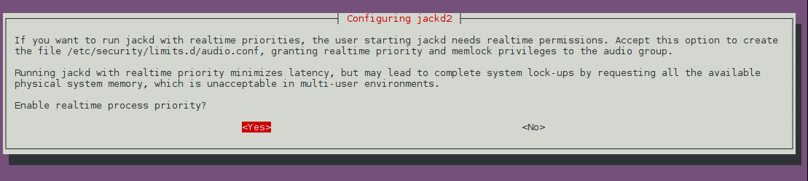

#7 Volume Output. In General...

**What is the difference between Analog Stereo Output and Digital Stereo Duplex?**

Duplex means you have input as well as output. You only need it if you have a microphone.

---

PulseAudio is a sound server providing professional audio features such as mixing and input/output routing. It is the default audio device on many Linux distributions including Ubuntu, Linux Mint, Open Suse and many Debian/Ubuntu-based distributions.

PulseAudio operates as a proxy between sound applications and the audio hardware (usually via ALSA). PulseAudio Volume Control provides a "Monitor" device which listens for the audio output of other applications such as Firefox or Rhythmbox. Setting PulseAudio Volume Control to capture from the Monitor device lets Audacity record computer playback when its input device is set to pulse.

http://manual.audacityteam.org/man/tutorial_recording_computer_playback_on_linux.html

---

**pactl vs. pacmd vs. alsa**

**pactl** - Control a running PulseAudio sound server

Synopsis

pactl [options]
stat

pactl [options] list

pactl [options] exit

pactl [options] upload-sample FILENAME [NAME]

pactl [options] play-sample NAME [SINK]

pactl [options]

remove-sample NAME

pactl [options] move-sink-input ID SINK

pactl [options]

move-source-input ID SOURCE

pactl [options] load-module NAME [ARGUMENTS ...]

pactl [options] unload-module ID

pactl [options] suspend-sink [SINK] 1|0

pactl [options] suspend-source [SOURCE] 1|0

pactl --help

pactl --version

Description

pactl can be used to issue control commands to the PulseAudio sound server.
pactl only exposes a subset of the available operations. For the full set use the pacmd(1).

**pacmd** - Reconfigure a PulseAudio sound server during runtime

Synopsis

pacmd
Description

This tool can be used to introspect or reconfigure a running PulseAudio sound server during runtime. It connects to the sound server and offers a simple live shell that can be used to enter the commands also understood in the default.pa configuration scripts.
This program takes no command line options.

**alsactl** - advanced controls for ALSA soundcard driver

Synopsis

alsactl [options] [store|restore|init] <card # or id or device>

Description

alsactl is used to control advanced settings for the ALSA soundcard drivers. It supports multiple soundcards. If your card has features that you can't seem to control from a mixer application, you have come to the right place.
Commands

store saves the current driver state for the selected soundcard to the configuration file.

restore loads driver state for the selected soundcard from the configuration file. If restoring fails (eventually partly), the init action is called.

init tries to initialize all devices to a default state. If device is not known, error code 99 is returned.

If no soundcards are specified, setup for all cards will be saved or loaded.

**alsamixer** - soundcard mixer for ALSA soundcard driver, with ncurses interface

Synopsis

alsamixer [options]

Description

alsamixer is an ncurses mixer program for use with the ALSA soundcard drivers. It supports multiple soundcards with multiple devices.
Options

-h, --help
Help: show available flags.
-c, --card <card number or identification>
Select the soundcard to use, if you have more than one. Cards are numbered from 0 (the default).
-D, --device <device identification>
Select the mixer device to control.
-V, --view <mode>
Select the starting view mode, either playback, capture or all.
-g, --no-color
Toggle the using of colors.

**amixer** - command-line mixer for ALSA soundcard driver

Synopsis

amixer [-option] [cmd]
Description

amixer allows command-line control of the mixer for the ALSA soundcard driver. amixer supports multiple soundcards.
amixer with no arguments will display the current mixer settings for the default soundcard and device. This is a good way to see a list of the simple mixer controls you can use.

**jackd** - JACK Audio Connection Kit sound server

Synopsis

jackd [options] -d backend [backend-parameters]
jackd --help
Description

jackd is the JACK audio server daemon, a low-latency audio server. Originally written for the GNU/Linux operating system, it also supports Mac OS X and various Unix platforms. JACK can connect a number of different client applications to an audio device and also to each other. Most clients are external, running in their own processes as normal applications. JACK also supports internal clients, which run within the jackd process using a loadable "plugin" interface.
JACK differs from other audio servers in being designed from the ground up for professional audio work. It focuses on two key areas: synchronous execution of all clients, and low latency operation.

